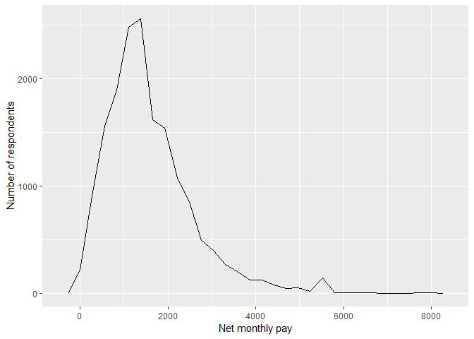
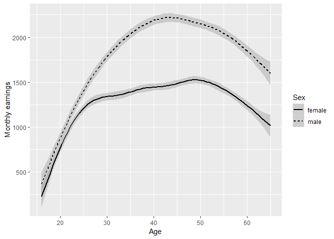
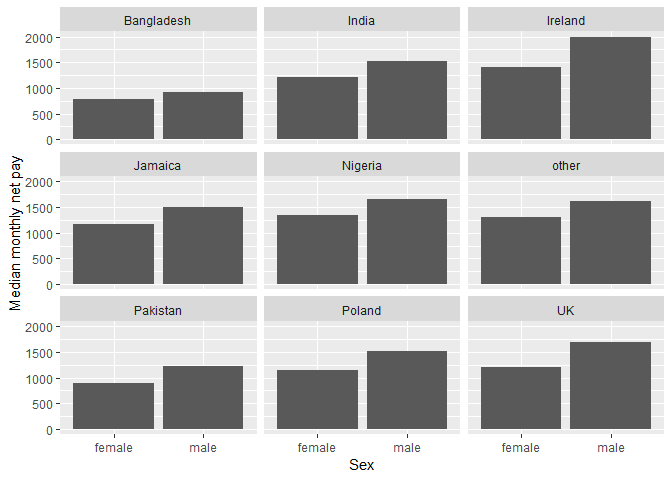
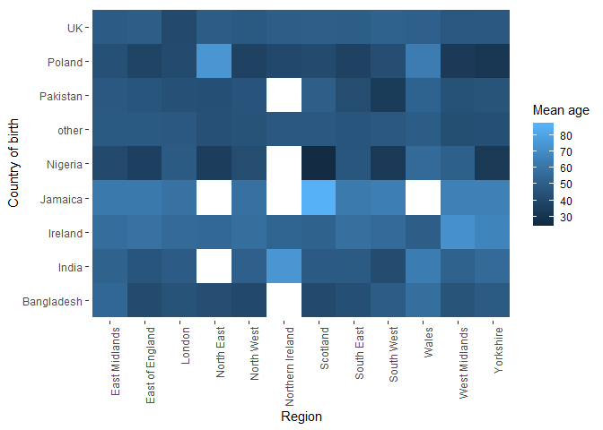
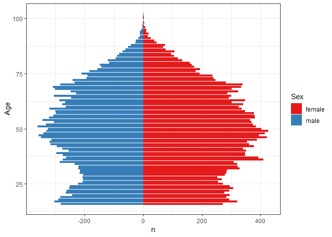

Statistical assignment 4
================
\[add your name here\]
\[add date here\]

In this assignment you will need to reproduce 5 ggplot graphs. I supply graphs as images; you need to write the ggplot2 code to reproduce them and knit and submit a Markdown document with the reproduced graphs (as well as your .Rmd file).

First we will need to open and recode the data. I supply the code for this; you only need to change the file paths.

    ```r
    library(tidyverse)
    Data8 <- read_tsv("C:\\Users\\ab789\\datan3_2019\\data\\UKDA-6614-tab\\tab\\ukhls_w8\\h_indresp.tab")

    Data8 <- Data8 %>%
        select(pidp, h_age_dv, h_payn_dv, h_gor_dv)

    Stable <- read_tsv("C:\\Users\\ab789\\datan3_2019\\data\\UKDA-6614-tab\\tab\\ukhls_wx\\xwavedat.tab")

    Stable <- Stable %>%
        select(pidp, sex_dv, ukborn, plbornc)

    Data <- Data8 %>% left_join(Stable, "pidp")

    rm(Data8, Stable)

    Data <- Data %>%
        mutate(sex_dv = ifelse(sex_dv == 1, "male",
                           ifelse(sex_dv == 2, "female", NA))) %>%
        mutate(h_payn_dv = ifelse(h_payn_dv < 0, NA, h_payn_dv)) %>%
        mutate(h_gor_dv = recode(h_gor_dv,
                         `-9` = NA_character_,
                         `1` = "North East",
                         `2` = "North West",
                         `3` = "Yorkshire",
                         `4` = "East Midlands",
                         `5` = "West Midlands",
                         `6` = "East of England",
                         `7` = "London",
                         `8` = "South East",
                         `9` = "South West",
                         `10` = "Wales",
                         `11` = "Scotland",
                         `12` = "Northern Ireland")) %>%
        mutate(placeBorn = case_when(
                ukborn  == -9 ~ NA_character_,
                ukborn < 5 ~ "UK",
                plbornc == 5 ~ "Ireland",
                plbornc == 18 ~ "India",
                plbornc == 19 ~ "Pakistan",
                plbornc == 20 ~ "Bangladesh",
                plbornc == 10 ~ "Poland",
                plbornc == 27 ~ "Jamaica",
                plbornc == 24 ~ "Nigeria",
                TRUE ~ "other")
        )
    ```

Reproduce the following graphs as close as you can. For each graph, write two sentences (not more!) describing its main message.

1.  Univariate distribution (20 points).

    

2.  Line chart (20 points). The lines show the non-parametric association between age and monthly earnings for men and women.

    

3.  Faceted bar chart (20 points).

    

4.  Heat map (20 points).

    

5.  Population pyramid (20 points).

    
